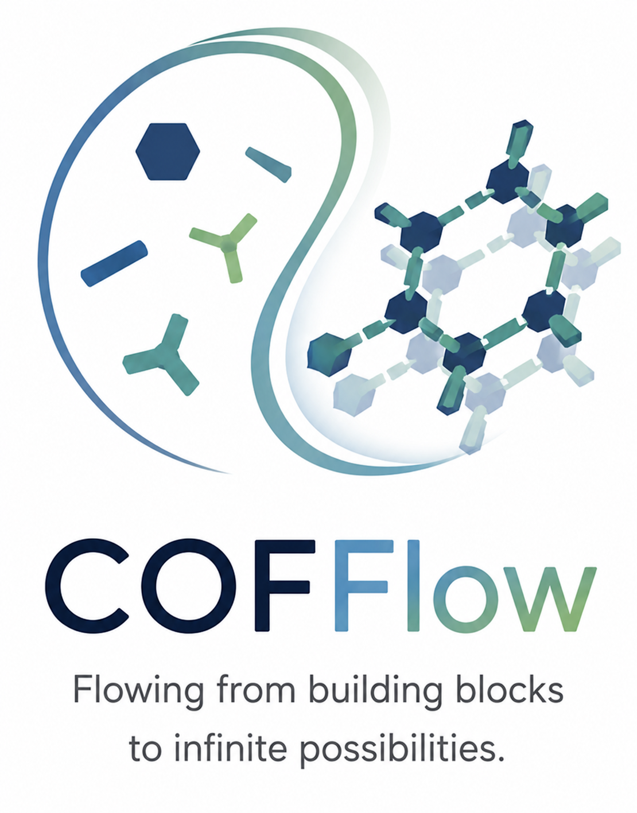
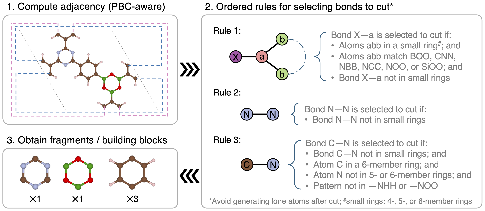

# COFFlow

<p align="center">
  
</p>

# COF Building Block Decomposition

This repository provides a Python workflow for decomposing CIF files of covalent organic frameworks (COFs) into constituent molecular building blocks.

The code is designed for high-throughput processing of large COF datasets. It reads periodic CIF files, reconstructs bonding under periodic boundary conditions (PBCs), identifies chemically meaningful bonds to cut, extracts molecular fragments, removes duplicate fragments globally, and writes unique building blocks as XYZ files.

The workflow is particularly useful for:

- constructing building-block datasets from COF databases;
- studying linker and node diversity in COFs;
- preparing datasets for machine learning and generative modeling;
- analyzing structural motifs and topology-dependent chemistry.

---

# Method Overview

<p align="center">
  
</p>

<p align="center">
  <b>Figure 1.</b> Schematic illustration of the COF decomposition workflow.
</p>

The overall decomposition workflow proceeds as follows:

1. Read periodic COF CIF structures.
2. Construct a supercell to recover periodic connectivity.
3. Identify the central image to avoid edge artifacts.
4. Build a periodic bonding graph using covalent-radius cutoffs.
5. Convert the graph into an RDKit molecular representation.
6. Detect chemically meaningful bonds to cut.
7. Fragment the structure into molecular building blocks.
8. Unwrap fragments across periodic boundaries.
9. Generate canonical molecular fingerprints.
10. Deduplicate fragments globally across all CIFs.
11. Save unique fragments and metadata.

---

# Workflow Details

## 1. Read COF CIF Files

Each COF structure is read using ASE:

```python
from ase.io import read
```

The workflow assumes periodic crystalline structures stored as `.cif` files.

---

## 2. Build a Periodic Supercell

To reconstruct bonds crossing unit-cell boundaries, the primitive cell is expanded into a supercell:

```text
repeat = (3, 3, 3)
```

This helps recover full molecular connectivity under periodic boundary conditions.

The default supercell size is:

```text
3 × 3 × 3
```

but can be modified with:

```bash
--repeat 3 3 3
```

---

## 3. Identify the Central Image

Only atoms belonging to the central periodic image are retained for molecular graph construction.

This avoids edge artifacts and prevents duplicated connectivity caused by periodic wrapping.

---

## 4. Reconstruct the Periodic Bonding Graph

Bond connectivity is reconstructed using interatomic distances and covalent radii:

```text
cutoff = scale × (r_i + r_j)
```

where:

- `r_i` and `r_j` are covalent radii;
- `scale` is a user-defined scaling factor.

Default:

```bash
--scale 1.20
```

Neighbor searching is performed using ASE neighbor lists.

---

## 5. Convert to an RDKit Molecular Graph

The periodic bonding graph is converted into an RDKit molecule.

This enables:

- ring analysis;
- bond fragmentation;
- canonical SMILES generation;
- graph-based molecular operations.

---

## 6. Identify Bonds to Cut

The workflow applies chemically motivated decomposition rules designed for COFs.

### Cutting logic includes:

- center-first patterns in small rings;
- selected B–O, N–O, N–N, C–N, and Si–O environments;
- ring-aware decomposition rules;
- local coordination analysis.

The code avoids:

- cutting bonds inside protected small rings;
- generating isolated single atoms after fragmentation.

A greedy filtering procedure ensures chemically meaningful fragments.

---

## 7. Fragment the Structure

RDKit fragmentation is performed using:

```python
Chem.FragmentOnBonds(...)
```

This produces disconnected molecular fragments corresponding to potential building blocks.

---

## 8. Unwrap Fragments Across Periodic Boundaries

Fragments split across periodic boundaries are unwrapped in fractional-coordinate space.

This ensures each fragment becomes a continuous molecular object before being written to disk.

Without this step, fragments crossing unit-cell boundaries would appear artificially broken.

---

## 9. Generate Molecular Fingerprints

Each fragment is converted into a canonical isomeric SMILES string:

```python
Chem.MolToSmiles(...)
```

The fingerprint is used to identify globally unique fragments.

Dummy atoms introduced during fragmentation are removed before fingerprint generation.

---

## 10. Global Deduplication

A SQLite database tracks all previously observed fragment fingerprints.

If a fragment already exists:

- it is not written again;
- its occurrence is recorded for bookkeeping.

This allows:

- efficient processing of very large datasets;
- resume support;
- global uniqueness tracking across all CIFs.

---

## 11. Write Outputs

The workflow produces:

- unique fragment `.xyz` files;
- a fragment record file;
- a SQLite database;
- a CSV mapping fragments to CIF structures.

---

# Installation

## Required Packages

- numpy
- ase
- rdkit

Install with pip:

```bash
pip install numpy ase
```

RDKit is usually easier to install via conda:

```bash
conda install -c conda-forge rdkit
```

Recommended environment:

```bash
conda create -n cof-decompose python=3.11
conda activate cof-decompose
conda install -c conda-forge rdkit ase numpy
```

---

# Usage

## Basic Example

```bash
python COFs_decompose.py \
    --cif-dir ./cifs \
    --out-dir ./uniq_xyz \
    --record ./fragments_record.txt \
    --db ./fragments_seen.sqlite \
    --csv-out ./fragment_to_cifs.csv
```

---

## Full Example

```bash
python COFs_decompose.py \
    --cif-dir ./cifs \
    --out-dir ./uniq_xyz \
    --record ./fragments_record.txt \
    --db ./fragments_seen.sqlite \
    --csv-out ./fragment_to_cifs.csv \
    --repeat 3 3 3 \
    --scale 1.20 \
    --span-warn 0.75 \
    --workers 16 \
    --resume
```

---

# Command-Line Arguments

| Argument | Description |
|---|---|
| `--cif-dir` | Directory containing input CIF files |
| `--out-dir` | Output directory for unique XYZ fragments |
| `--record` | Text record file for fragment bookkeeping |
| `--db` | SQLite database for deduplication and resume support |
| `--csv-out` | CSV mapping fragments to CIF structures |
| `--repeat` | Supercell replication size |
| `--scale` | Covalent-radius scaling factor for bond detection |
| `--span-warn` | Warn if fragment spans too much fractional space |
| `--workers` | Number of parallel worker processes |
| `--max-files` | Maximum number of CIFs to process |
| `--resume` | Skip CIFs already processed |

---

# Output Files

## 1. Unique Fragment XYZ Files

Output directory:

```text
./uniq_xyz/
```

Example:

```text
opt_example_uniq00000001.xyz
```

Each XYZ file corresponds to a globally unique fragment.

---

## 2. Fragment Record File

Example:

```text
example.cif    00000001    SMI:C1=CC=CC=C1    uniq_xyz/example_uniq00000001.xyz
```

Columns:

| Column | Meaning |
|---|---|
| CIF | Source CIF file |
| unique_fragment_index | Global fragment index |
| fingerprint | Canonical fingerprint |
| xyz_path | Path to XYZ file |

---

## 3. SQLite Database

The SQLite database stores:

- fragment fingerprints;
- processed CIF files;
- fragment occurrences;
- resume information.

This enables robust large-scale processing.

---

## 4. Fragment-to-CIF CSV

Example:

```text
fragment_idx,n_cifs,cif_basenames
```

This file maps each unique fragment to all CIF structures containing it.

---

# Parallel Processing

The workflow supports multiprocessing using:

```python
ProcessPoolExecutor
```

Example:

```bash
--workers 32
```

Threading for BLAS/OpenMP libraries is automatically limited to reduce oversubscription on HPC systems.

---

# Resume Support

Interrupted jobs can be resumed using:

```bash
--resume
```

Previously completed CIF files will be skipped automatically.

---

# Notes and Limitations

- The current implementation assumes single-bond connectivity in the RDKit graph.
- Fragment uniqueness is determined using canonical isomeric SMILES.
- Bonding is reconstructed using covalent-radius heuristics.
- The workflow is primarily designed for COFs and related porous organic frameworks.
- Cutting rules may need adjustment for unusual linkage chemistries.

---

# Possible Future Improvements

Potential future extensions include:

- bond-order assignment;
- topology-aware decomposition;
- visualization utilities;
- direct CIF export for fragments;
- support for MOFs and hybrid materials;
- graph neural network dataset generation;
- integration with generative AI workflows.

---

# Citation

If you use this code in your work, please cite:

```text
[Add citation here]
```
